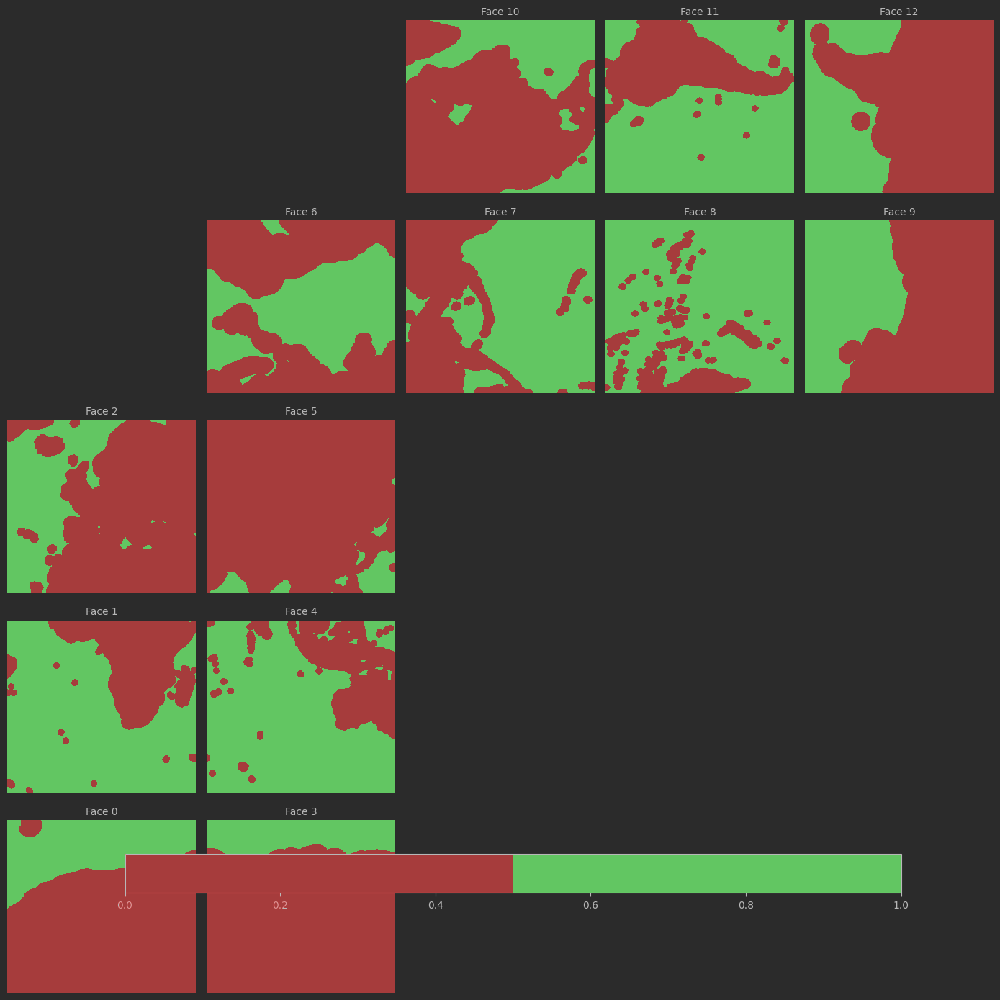
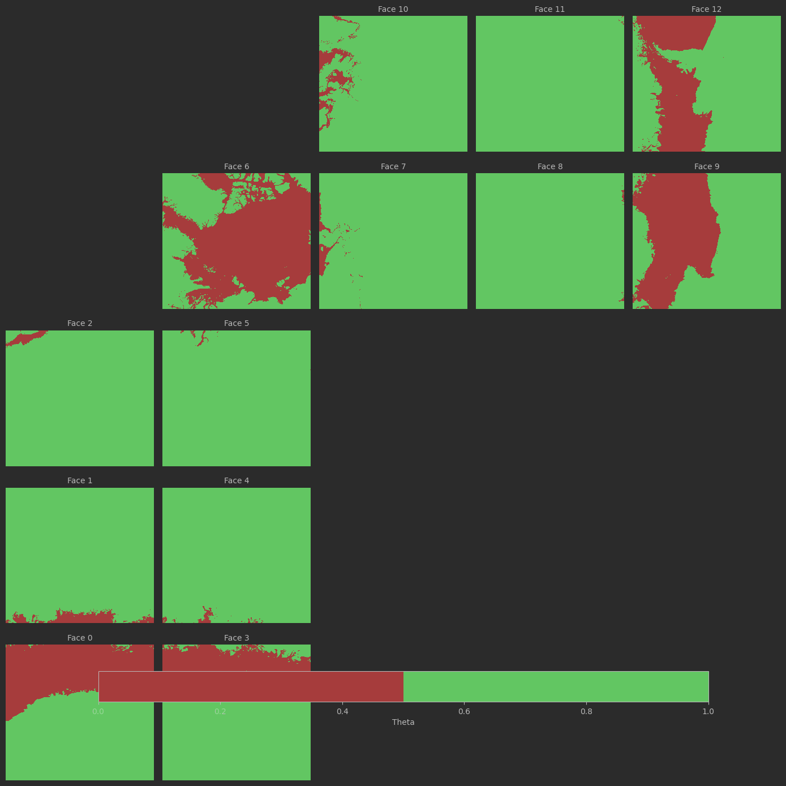
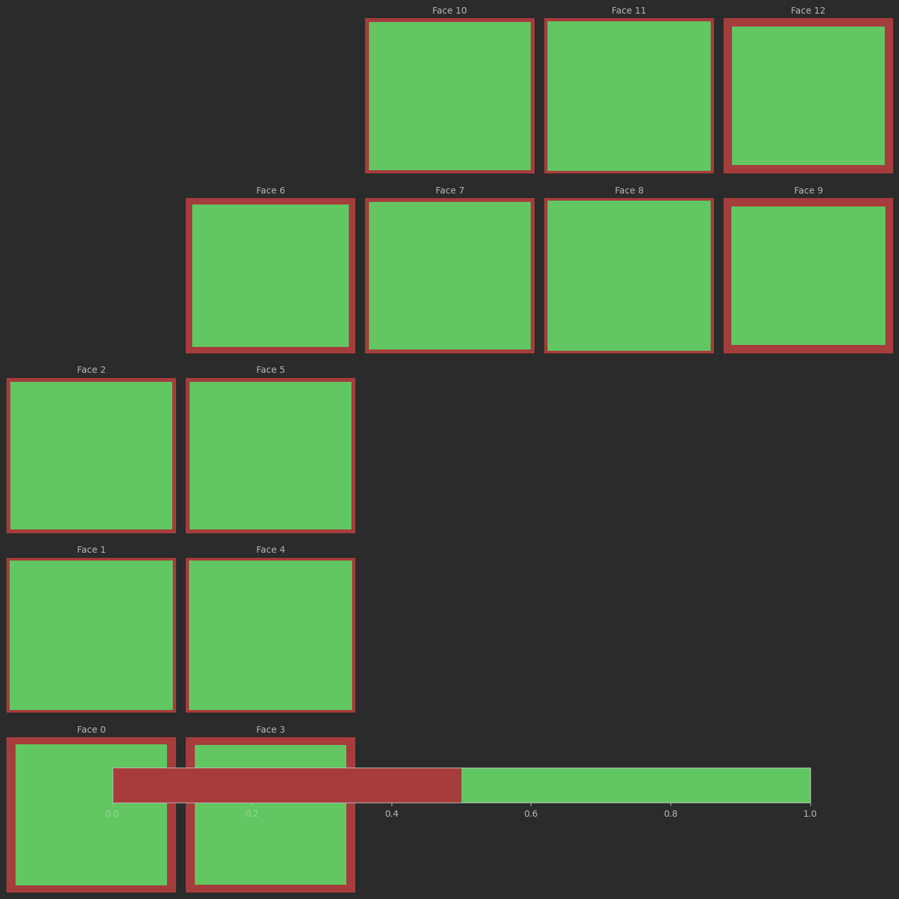
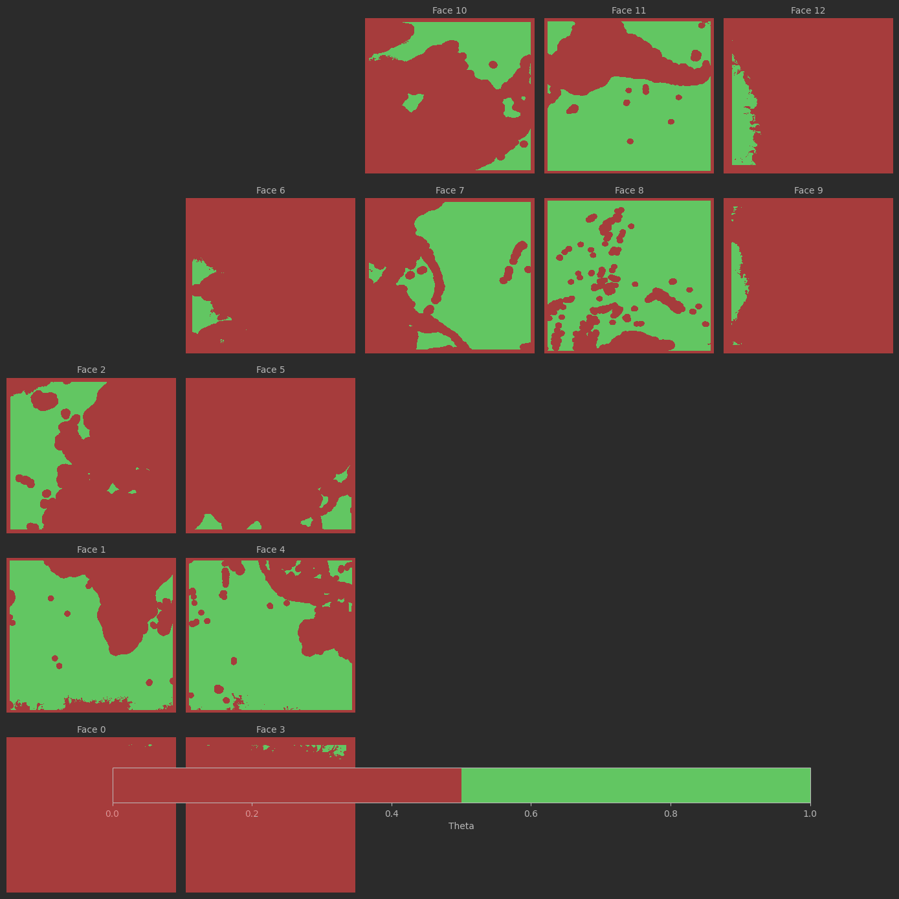
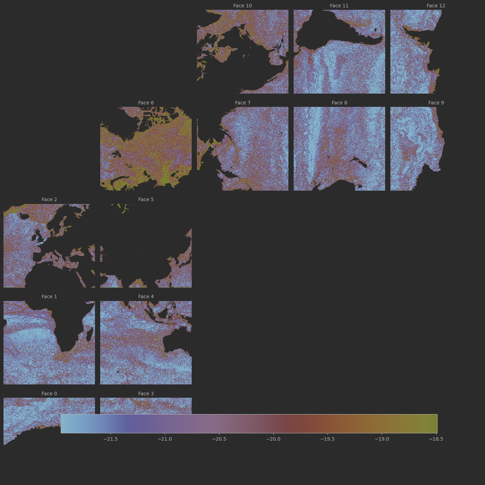
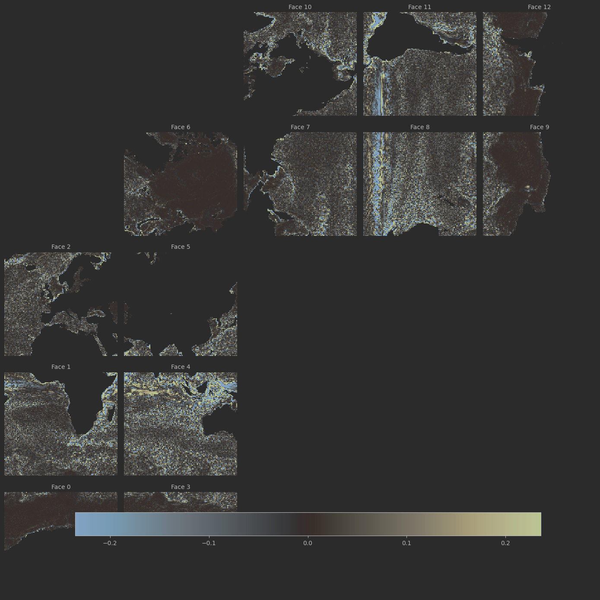
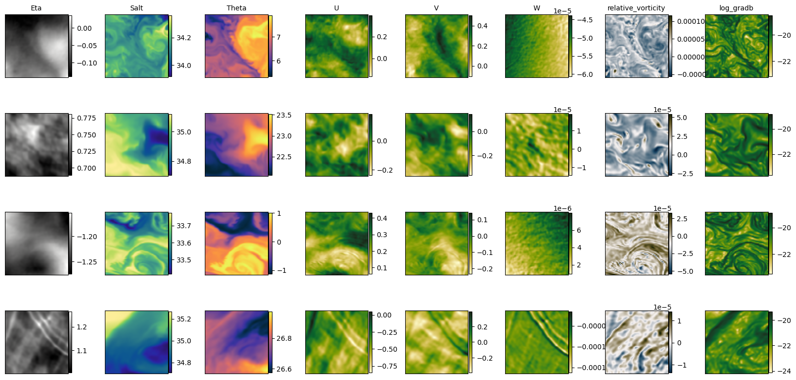

# Quickstart User Guide 

## Dataset Generation

This repository contains tools for generating training datasets from the LLC4320 ocean model.

To run or understand the dataset generation workflow, **start with the Jupyter notebook**:

`notebooks/running_generate_front_training_data_script.ipynb`

The notebook documents:
- required configuration files
- how temporal and spatial sampling are defined
- how to launch a dataset generation run

## Dataset Access

To explore and inspect generated datasets, see the Jupyter notebook:

`notebooks/access_dbof_dataset.ipynb`

This notebook demonstrates:
- how to connect to the remote Zarr store containing image patches
- how to read individual samples and batches from the dataset
- how to load and inspect the associated Parquet metadata
- how to link metadata fields (location, time, gradients) back to image samples
- basic visualization examples for checking the data

The notebook is intended as a reference for integrating the dataset into downstream training workflows.

## Build the Project for Downstream Data Access

Users who want to **read or train on datasets produced by this pipeline** can install the package as a normal Python dependency.

Install directly from GitHub:
```bash
pip install "git+https://github.com/Sea-Meets-the-Stars/llc4320-native-grid-preprocessing.git"
```
Optional dependency groups can be installed as needed (for example, plotting utilities used in the notebooks):
```bash
pip install "dbof-in-native-grid[plotting] @ git+https://github.com/Sea-Meets-the-Stars/llc4320-native-grid-preprocessing.git"
```
A running list of optional dependencies are:
- plotting

User can also clone locally and install via 
```
git clone https://github.com/Sea-Meets-the-Stars/llc4320-native-grid-preprocessing.git
cd llc4320-native-grid-preprocessing
pip install -e .
```

After installation, dataset readers and utilities can be imported in downstream code, for example:
```
from dbof.dataset_creation.zarr_dataset import ZarrDatasetReader, ZarrTorchDataset
```

# An explanation of the dataset generation
This section aims to give the reader a rough outline of the steps taken to generate DBOF 
from raw llc4320 output to data cutouts.

Briefly, our software loops through time snapshots of raw LLC4320 data. For each snapshot we sample a number of model 
grid cell points from the data. 

We then generate a fixed km and fixed pixel size cutout of data centered around each sample point. 
These cutouts are then stored remotely for downstream tasks such as ML training. 

## Accessing Raw LLC4320 Data and Preprocessing 
To generate the data cutouts we need to access the llc4320 data and grid file. We currently only support data from the 
LLC4320 model and only from one source. In the future we could support other models and data sources if needed. 

[Accessing_Raw_LLC4320_Data.md](docs/Accessing_Raw_LLC4320_Data.md) describes accessing the raw llc4320 data from 
location : https://mghp.osn.xsede.org

The user decides which iterations of raw data they wish processed. 
More information on this can be found in [running_generate_front_training_data_script.ipynb](notebooks/running_generate_front_training_data_script.ipynb)

We only need to load the grid file once per run, so this is not loaded per iteration. 
The only variables we load from the grid file are ['XC', 'YC', 'dxC', 'dyC', 'dxG', 'dyG', 'rAz', 'rA', 'Depth', 'hFacC', 'SN', 'CS']

We then loop through every iteration requested by the user. For each iteration we load the raw data. 
We merge the data with the grid file variables for later calculations.

## Masking 
Before we find our sample points we must mask out some of the possible sample locations. 
This is to avoid invalid data present in our cutouts. 
Around each region of masked data we also generate a halo. This is to ensure that data sampled to fill a cutout around 
a sampled point does not bleed into invalid data. For example a point sampled near a coastline would be valid but the 
cutout would then contain land. 

[Halo_Masking.md](docs/Halo_Masking.md) details the algorithm used for generating the halo masks. 

Masked Data:
- Land - There is no valid data on land. 
- Ice - We are not interested currently in sea ice. (Note a halo is not generated for this mask)
- Face Boundaries - To simplify the cutout generation process, we do not generate cutouts across face boundaries. 
No data is lost by this simplification, we just don't allow our samples to fall on the boundaries between faces. 

The land and Face Boundaries mask are generated only once per run. Obviously these regions do not change between iterations.
Ice is determined at each iteration. 

[Ice_Masking.md](docs/Ice_Masking.md) gives more info on ice masking. 

### Example of each mask :
### Land Mask 


### Ice mask (freezing point = 0)


### Face Boundary Mask


### Combined Mask


## Calculated Fields 
We support the following calculated fields from the raw data :
- Log of gradient of buoyancy squared log(ΔB^2)

- Relative Vorticity. See below a smoothed image.


These values are calculated lazily globaly over the entire iteration. However, the calculation is not actually done 
until at the cutout level we call Dask compute. So the calculation is only done for the cutout region. With the exception 
of log(ΔB^2) which is used for sampling. 

## Sampling 
We must then choose a number of cutout centers from each iteration. This is referred to as sampling here. 
We support the following sampling methods :
- weighted sampling by log(ΔB^2). See [Weighted_Sampling.md](docs/Weighted_Sampling.md) for more information. 

## Extracting Cutouts and Dask Pipeline
Once our centers are sampled we can generate our cutouts. This process is as follows:
1. Determine the required cells in each direction around our sampled center point to make up the requested fixed km size. 
2. Sample data from these cells which will trigger our lazy calculations.
3. Downsample our patches into fixed resolution images. 
4. Write metadata and image data to remote storage. 

This process is parallelized with Dask and more information on the pipeline can be found in 
[Cutout_Generationg_Pipeline.md](docs/Cutout_Generationg_Pipeline.md).

## Dataset
The resulting dataset is a number of cutouts with fixed km and pixel size with each model layer and calculated layer as 
channels. The dataset can be accessed using a provided class. See [access_dbof_dataset.ipynb](notebooks/access_dbof_dataset.ipynb).

