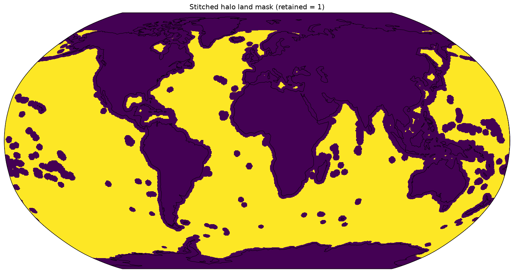
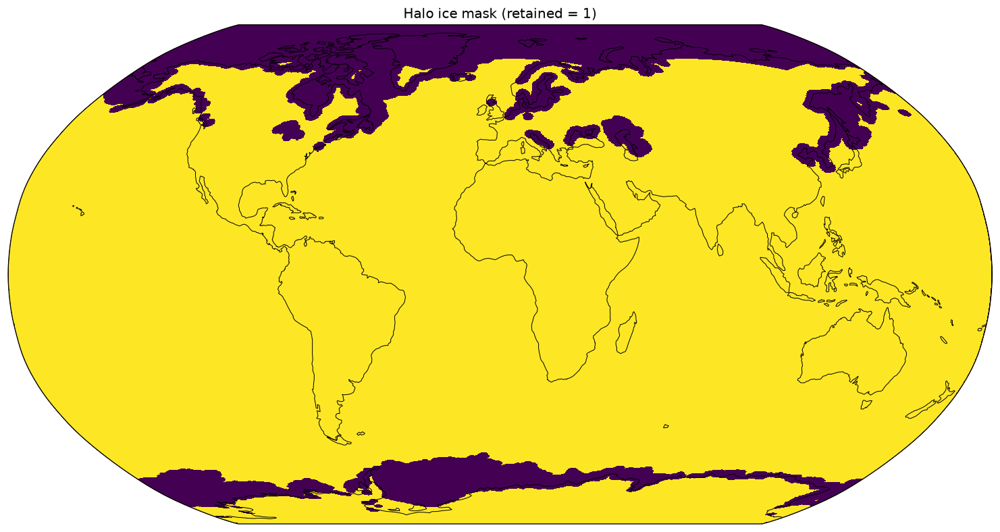

# Halo Masking

A **halo mask** excludes grid cells within a physical buffer (measured in real km) of an unwanted region (land or
sea ice). Mostly used for sampled cutout centers to stay far enough away that the cutout doesn't overlap it.
The buffer distance is usually the cutout size (`target_km_res`). 

## Why
In context of cutout sampling, each cutout spans `target_km_res` km. A center near land/ice yields a cutout that overlaps
land/ice. Buffering the excluded region by ~one cutout width keeps sampled cutouts in open water.

## Algorithm
`halo_mask.stitched_halo_mask(mask, dxC, dyC, halo_km)`:
- input `mask`: `True` = cells to exclude (land or ice).
- builds a signed level set and runs fast marching (`skfmm.distance`) to get each cell's
  distance (km, from `dxC`/`dyC`) to the nearest excluded cell.
- returns `True` where distance ≥ `halo_km` (retained). `llc_native_grid_halo_mask` is the
  per-face variant for the native grid.

## Land mask
`static_masks.generate_halo_land_mask(ds_grid, target_km_res, stitched=True)` — land is
`hFacC == 0`, buffered by `target_km_res`. Static: computed once per run.


## Ice mask
`ice_mask.generate_halo_ice_mask(ds_grid, ice_mask, target_km_res, stitched=True)` — ice is
`SIarea > 0` (`generate_siarea_mask`), buffered by `target_km_res`. Per-snapshot: ice moves.


## Sampling mask
Cutouts are sampled where **both** hold:
`build_sampling_mask = halo_ice_mask & land_halo_mask` (`True` = eligible ocean).


## Import
```
import dbof.preprocessing.static_masks as static_masks
import dbof.preprocessing.ice_mask as ice_mask
```

## Notes
- Convention: input mask `True` = excluded; output `True` = retained.
- `halo_km` defaults to `target_km_res`.
- Fast marching runs over the full stitched grid — the heaviest per-run / per-snapshot step.
- This can rarely fail in the cutout generation leaving land or ice in cutouts at very specific location on the grid. This is a
chosen sacrifice as a larger km buffer would exclude more of our data source. 

## Related
- [Generating Cutout Data](generating_cutout_data_v1_2.md)
- [Sampling with ΔB²](Sampling_With_GradB2.md)
