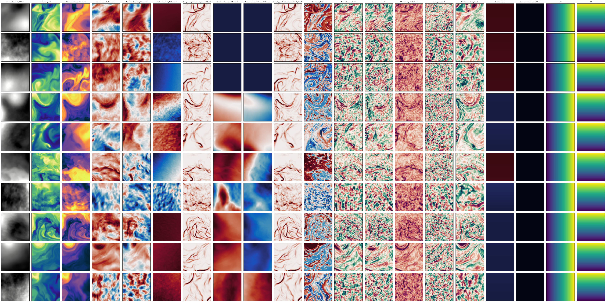

# Reading Cutout Data

Read a generated cutout dataset (Zarr images + Parquet metadata) back into memory,
row-aligned, via `dbof.cutout_dataset_access`.

## Access config
A data-access YAML locates the dataset (`bucket`, `folder`, `dataset_name`, `s3_endpoint`);
`run_id` is passed at read time, so one config can serve many runs where the output location is the same. Example:
`configs/cutouts/data_access/cutout_test_data_v1.yaml`.

## Load
```python
from dbof.cutout_dataset_access.access import load_cutout_dataset

ds = load_cutout_dataset(
    "configs/cutouts/data_access/cutout_test_data_v1.yaml",
    run_id="cutout_test_data_v1",          # overrides the config's run_id
)

ds.images         # dask (N, C, H, W), lazy
ds.metadata       # DataFrame, row-aligned:  images[k] <-> metadata.iloc[k]
ds.channel_names  # channel order (feature_channels + XC, YC)
```
Builds the filesystems from the config's endpoint, links images to metadata by `image_id`,
and drops empty store slots / holes.

## Visualize
```python
from dbof.cutout_dataset_access.access import plot_random_cutouts

fig, meta = plot_random_cutouts(ds, n=5)   # random cutouts, per-feature colormaps
```



## Notes
- `ds.images` stays lazy — subset then `.compute()` to pull into RAM.
- Channel order comes from the store's `channel_names`; don't hardcode it.
- Coordinate channels `XC`/`YC` (lon/lat) are nearest-downsampled.

## Related
- [Generating Cutout Data](generating_cutout_data_v1_2.md)
