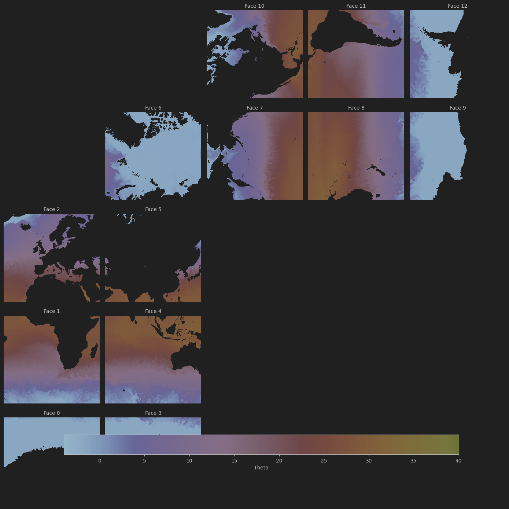

# Sampling with Log ΔB^2 

In this document we discuss our approach to sampling data patches based on the ΔB^2 value. 

## Log ΔB^2 Calculation 

### Buoyancy
is calculated at each tracer cell as 

### ΔB^2 

### Log Scale

## ΔB^2 Probability Map
The sampling is done using the weighted coordinate sampling module.
See Weighted_Sampling.md for more information on this algorithm. 

Below we visualize the probability mapping of ΔB^2 for various biases. 

Bias : 

## Sampling Points 

## River Outflow Issue 