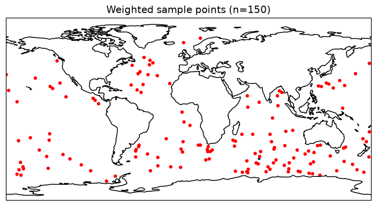

# Sampling with Log ΔB²

Cutout centers are sampled with probability weighted by the surface **buoyancy gradient
magnitude squared** (ΔB²). This intends to concentrate cutouts on
dynamically active regions. Sampling runs on `log10(ΔB²)` — see [Weighted Sampling](Weighted_Sampling.md).

## Log ΔB² calculation
ΔB² is computed in **generate-global** (the `frontal_structure` subset) and stored as the
`gradb2` channel; the cutout job reads it and takes `log10` at sample time
(`processing.sample_cutout_centers_with_loggradb`). Reference impl:
`calculate_additional_fields.grad_b2` / `log_grad_b`.

### Buoyancy
Surface buoyancy `b` is derived from `Theta` and `Salt` (`physical_calculations.buoyancy_of_field`).

### ΔB²
Horizontal gradient of `b` on the native grid, then squared magnitude:
`ΔB² = (∂b/∂x)² + (∂b/∂y)²`  (units s⁻⁴).

### Log scale
ΔB² spans many orders of magnitude, so we sample on `log10(ΔB²)`. Combined with the
exponential weight `exp(bias·(v − min))`, `bias` then acts as a power-law knob on ΔB².

## ΔB² probability map
Sampling uses the [weighted coordinate sampling](Weighted_Sampling.md) module on
`log10(ΔB²)`, restricted to the ocean mask (land + ice halos). Higher `bias` → more
concentrated on fronts.

## Sampling points
Controlled by `sampling.sample_points_per_snapshot` and `sampling.bias_to_high_gradients`
in the run config.

## River outflow issue
Freshwater river outflows produce very large ΔB², which can dominate the weighting and pull a
disproportionate share of cutouts toward river mouths. This is controlled by the bias weight. If the weight is too high,
all samples will be drawn from near freshwater or ice melt. The tuned value is 1.3. 

## Related
- [Weighted Sampling](Weighted_Sampling.md)
- [Generating Cutout Data](generating_cutout_data_v1_2.md)
