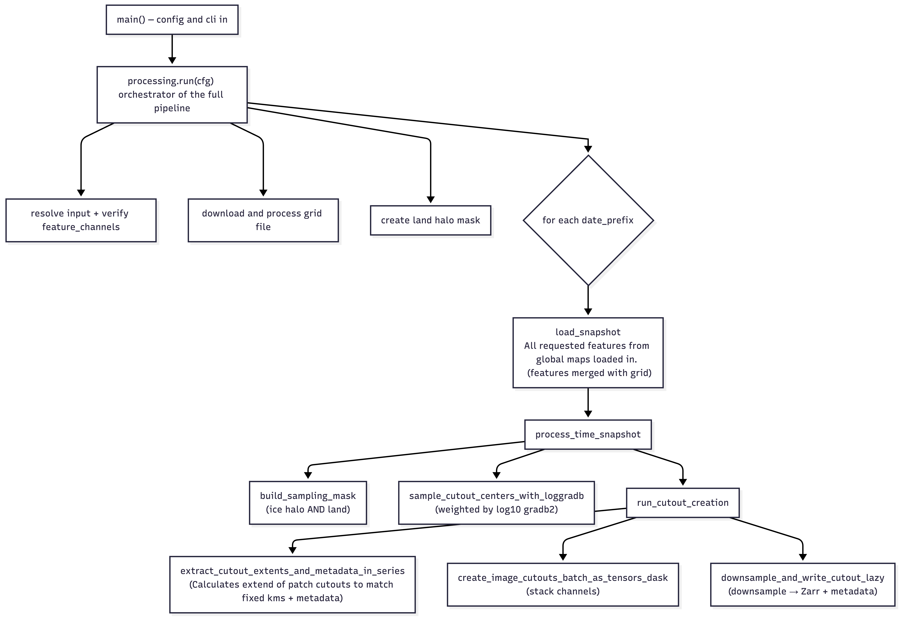

# Generating Cutout Data (v1.2)

Builds an ML cutout dataset from **generate-global** snapshots: sample cutout centers
(biased toward fronts), extract fixed physical-size cutouts of the requested channels,
downsample, and write a Zarr image dataset + Parquet metadata to S3.

Entry point: CLI `generate-llc-dataset` (`dbof.cli.generate_cutout_dataset:main`).
Orchestration lives in `dbof.cutout_dataset_creation.processing.run`.

## Input & Output
- **In** — generate-global rectangular snapshots (`<subset>.zarr` per `date_prefix`) plus
  the LLC4320 grid store. See [Global_Maps.md](Global_Maps.md) and
  [S3 layout](nautilus/s3_DBOF.md).
- **Out** — `cutout_dataset_creation.zarr`: `images (N, C, H, W)` + `image_ids`, with a
  `channel_names` attr; Parquet metadata alongside under `.../metadata/`. Read it back with
  [Reading Cutout Data](Reading_Cutout_Data.md).

## Config
One YAML controls the run (input source, `feature_channels`, sampling, cutout geometry,
output). See the [running cutouts notebook](../notebooks/notebooks_cutouts/running_generate_front_training_data_script.ipynb) and
`configs/cutouts/run/run_from_globals_example.yaml`.

## Code flow (skeleton)

## Key steps
- **Masks** — static land halo + per-snapshot ice halo (from `SIarea`). See [Halo Masking](Halo_Masking.md).
- **Sampling** — centers drawn without replacement, weighted by `log10(gradb2)`. See
  [Sampling with ΔB²](Sampling_With_GradB2.md) and [Weighted Sampling](Weighted_Sampling.md).
- **Cutout geometry** — fixed `target_km_res` extent per center, downsampled to
  `down_sample_res` px (features area-averaged, `XC`/`YC` nearest). Cutouts off the grid edge
  are dropped. See [Cutout Geometry](Cutout_Geometry.md).
- **Channels** — `feature_channels` in order, with `XC`/`YC` (lon/lat) appended; the order is
  recorded in the store's `channel_names`.

## Testing
See [Testing](Testing.md) for the suite layout and run commands.
