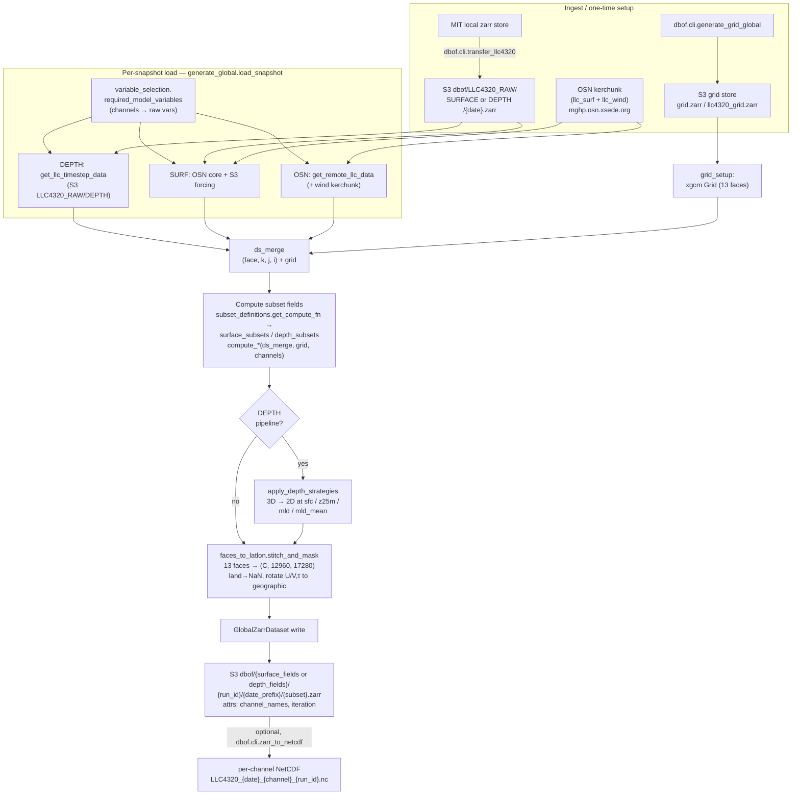
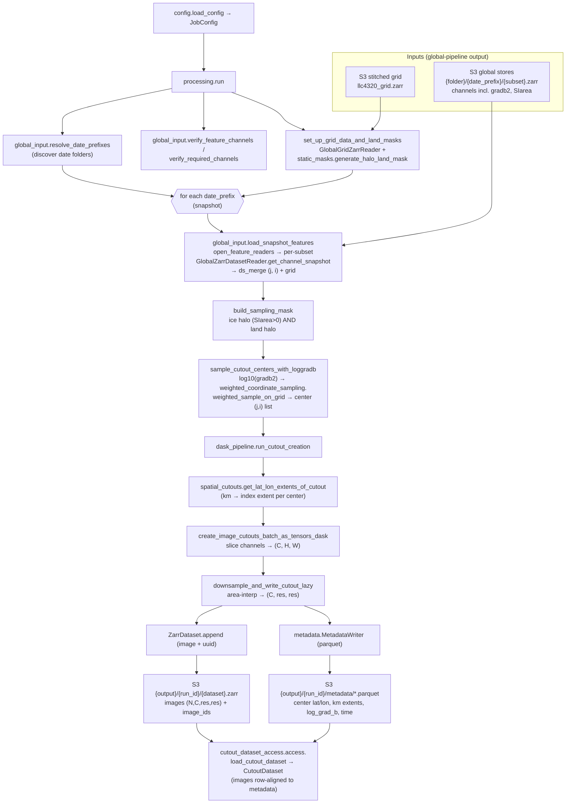
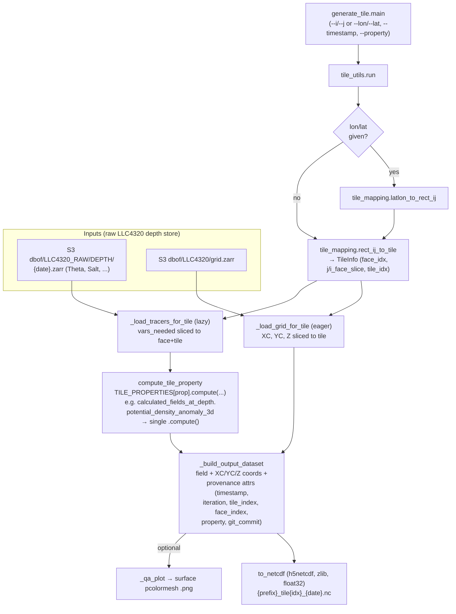

# Pipeline Data-Flow Diagrams

This page shows how data moves through the three pipelines in this
repository, as [Mermaid](https://mermaid.js.org/) flowcharts:

1. **Global** — build stitched, rectangular global fields (surface or
   depth-resolved) from raw LLC4320 data.
2. **Cutouts** — sample small, downsampled image cutouts from the global
   fields for ML training.
3. **Tiles** — extract a single 720×720 tile of one field from the raw
   LLC4320 depth store (a lightweight, on-demand path).

The pipelines are staged: **Global → Cutouts**. The **Tiles** pipeline is
independent and reads the raw depth store directly.

> Rendering note: these use fenced ```mermaid blocks, which GitHub renders
> natively. For the Read the Docs / Sphinx build, the `sphinxcontrib-mermaid`
> extension (or MyST's `mermaid` fence) must be enabled — see the Q&A in
> `prompts/claude_docs.md`.

Node labels reference the real modules/functions so the diagrams double as a
code map. S3 locations use the `dbof` bucket on the NRP/Nautilus endpoint
`https://s3-west.nrp-nautilus.io` unless noted.

---

## 1. Global pipeline

Entry point: `dbof.cli.generate_global:main` (batch driver:
`dbof.cli.run_all_subsets`). Three mutually exclusive pipeline variants —
**SURF**, **OSN**, **DEPTH** — differ only in where a snapshot's raw data is
read from and whether depth strategies run.



**Subsets** (each written as its own `{subset}.zarr`): `native_fields`,
`surface_wind`, `icearea`, `frontal_structure`, `kinematic`,
`frontogenesis` (all pipelines) plus `stratification`, `vertical_shear`,
`mixing_parameters`, `ertel_pv`, `buoyancy_fluxes`, `energetics` (DEPTH
only). See `docs/Global_Maps.md` for the full channel lists.

---

## 2. Cutouts pipeline

Entry point: `dbof.cli.generate_cutout_dataset:main` →
`dbof.cutout_dataset_creation.processing.run`. **Consumes the global
pipeline's output** (the `{date_prefix}/{subset}.zarr` stores, which must
include `gradb2` for sampling and `SIarea` for the ice mask) plus the
stitched global grid store. Produces downsampled image cutouts + metadata.



---

## 3. Tiles pipeline

Entry point: `dbof.cli.generate_tile:main` → `dbof.tiles.tile_utils.run`.
Independent, on-demand path: extract **one 720×720 tile** of a single
property from the raw LLC4320 **depth** store and write it to NetCDF with
full provenance. No global store required.



**Registered properties** (`tile_utils.TILE_PROPERTIES`): `density`
(σ₀ via JMD95), `temperature` (Θ), `salinity` (S). Add a new property by
registering a `TileProperty` with its `vars_needed` and a `compute`
callback.
